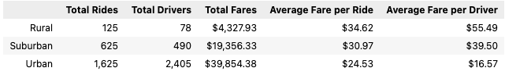
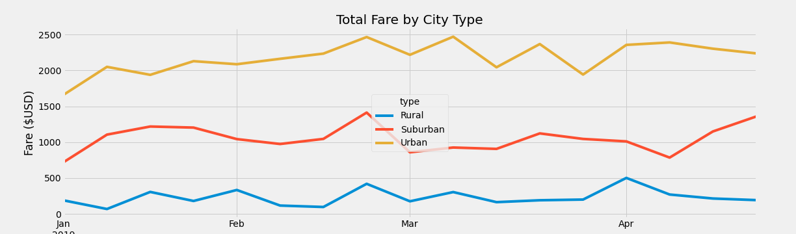

# PyBer_Analysis


## Overview

This project was in support of the ride-sharing app company PyBer, and was an analysis of all the rideshare data between January and May of 2019. The data was broken up into cities, with each city labeled as either Rural, Urban, or Suburban. Additionally provided datapoints were ride fares, driver counts, and individual ride IDs and ride timestamps.

The goal of this analysis was to identify any trends and/or disparities in the data.

## Results

The following analysis was pulled from the data provided, which consisted of individual ride information ranging from 01 January 2019 to 08 May 2019. Teh dataset contained **2,375 datapoints, or total rides**.

### Rideshare Statistics Summary
The following dataframe summarizes multiple analyses, including:
- Total Rides by City Type
- Total Drivers by City Type
- Total Fares by City Type
- Average Fare per Ride
- Average Fare per Driver



#### Observation: the Urban Driver to Ride Ratio
Urban cities clearly have more rides, drivers, and overall fare revenue than Rural and Suburban combined. However, there is an issue with the Urban dataset that must be pointed out - **there are more total urban drivers than there are total rides**. In fact, assuming that each ride is completed by a unique driver, there are **780 urban drivers who did not have work**.

Additionally, this means that the average fare per driver calculation is skewed, as it included the drivers who did not complete rides. The following code was used to populate this column:

```python
# The total drivers for each city type
total_drivers = city_data_df.groupby(["type"]).sum()["driver_count"]
# The total amount of fares for each city type
total_fares = pyber_data_df.groupby(["type"]).sum()["fare"]
# The average fare per driver
avg_fare_byDriver = total_fares / total_drivers
```
Again, assuming that each ride is completed by a unique driver (all drivers only have a maximum of one ride completed), the average fare per driver actually comes to **$24.53**. 

Conversely, the Rural and Suburban driver counts are less than the total ride counts, meaning there were drivers who completed multiple rides.

### Total Fare by City Type



The chart above displays total fares by city, grouped by week. The scope of this chart was reduced to the beginning of January to the very end of April.

Though there are various peaks and valleys, all three lines stay relatively constant within their ranges. There is a peak in the last week of February that is universal across all city types, but trends diverge a the end of April when Rural and Urban fares trend downward and Suburban fares rise to their maximum range.

## Summary

Based on the data above, three recommendations come to mind:

1. Reduce or limit the number of drivers in Urban areas, as they are not needed given the lower ride count. If there is a cost associated with having drivers on-call, this could be a savings.
2. Alternatively, with a surplus of available PyBer drivers in urban cities, PyBer should focus its efforts on determining why more ride sharing is not occurring. A heavy marketing campaign leading to full utilization of available PyBer drivers would lead to a considerable increase in total fares. In fact, with an estimated 780 inactive drivers available to complete rides, at $24.53 a ride, one ride per driver would yield **$19,133.40 additional in fare revenue**.
3. The rural market might benefit from a reduced fare price, as the fare is the highest per ride, per driver. Granted, most rides in rural areas are likely a further distance than others, and rural populations are considerably less than suburban and urban settings, the data shows rural as having the highest average fare by $3.65, and significantly the lowest ride count. The need for ride sharing in rural settings might also be less, so a reduction in fare might make ride sharing more practical and yield higher interest in the program. 
   1. Additionally, given that a vehicle is a necessity in rural areas and individuals likely have less interest in ride sharing, pivoting the rural focus to grocery delivery might or some type of ride share-based service make up the gap in rural ride share revenue.